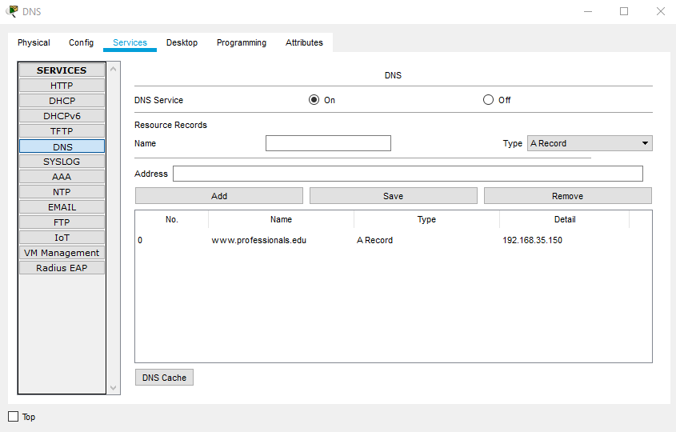
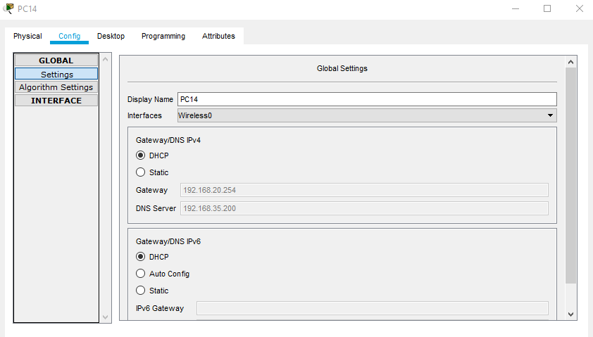

# Design a full-fledged network for an organization with multiple subnets

<h4>Abstract: </h4>

The goal of this project was to have a thorough understanding of how a complex 
mesh of networks functions. This project also provided me with insight into how a 
sophisticated network architecture can be implemented in practice. Computer 
Network Is a collection of computers and other devices. When you're linked to the 
internet, you can communicate. sharing of information and equipment in a network 
This is a multi-dimensional network. The network design I presented should ideally 
meet all of the requirements and be as near to a real-world implementation as 
possible.

<h4>Objective:</h4>

The primary objective was to design a complete model of a complex network by 
discovering the interconnectivity of the systems and sub-networks, which will reflect 
the East West University structure and facilities.
The main objective of this project is to complete a model of a complex network by 
discovering the interconnectivity of the systems and subnetworks, which will reflect 
the East West University
University of Professionalsstructure and facilities, features.
A webpage for University of Professionals was also to be created, and it would be 
accessible at http://www.professionals.edu. To access the network, each Campus 
was also provided a wireless access point. The complicated network included all six 
of the university's campuses, as well as sub-nets within each campus.
Elements which are used to make this network:
• Routers
• Switches
• Connectors (Straight Through Cable and Serial DCE)
• Servers (DNS, DHCP, WEB)
• PCs
• Wireless Access points
• Laptop.

<h4>Implementation of this network:</h4>

Cisco Packet Tracer was used to implement the network design. A hexagonal shaped 
network of routers was deployed to cover all six campuses as well as connect them 
to a separate Server Room. Wi-Fi and wireless Access Points are also provided in 
each campus through which other devices can connect to the network wirelessly.

  

Each Router has complex routing capabilities, allowing it to connect to any of the 
other networks in the complex mesh. Six diagonals were connected, and routing 
paths were set up through those diagonals. This provided extra security and mesh 
endurance, as well as the capacity to route through different paths in the event that 
one or more routers went down.

  

Here 5 server pools were used which is for DHCP, DNS and Web Server. All of 
these servers were stored in a separate Server Room from the rest of the Campus 
networks.

  

The DNS server was used so that all hosts may visit the Web Server's webpage using 
the required web address rather than the Web Server's IP address.
The host PCs on each campus obtained their IP addresses dynamically from a single 
DHCP server. It is also possible to add new hosts to the network without having to 
manually assign IP addresses using this setup. DHCP also sent information about 
the DNS server to the hosts.

  
  

The DHCP server was used to dynamically assign IP addresses to all hosts on the 
six campuses, as well as the many Sub-Nets within each campus.
Wireless connections were made possible by the presence of wireless Access Points 
in each network. WEP encryption was used to secure the Access Points, and 
connecting devices required a password to connect to the wireless network.

  
  
  
  
  
  

And that is how, the complete network was properly connected and communications 
between any of the complicated network's devices were established.
Special Requirements:
As per the special requirements for creating this network,
• Dynamically supply IP addresses to hosts belonging to all of the different 
networks, only one DHCP server was utilized.
• The servers were maintained in a server room, which was connected to a 
separate LAN.
• Each of the Campus Networks now includes Sub-Nets.
• The complex mesh was built with extra diagonal paths to ensure that other 
communications do not suffer if one or more routers fail.
<h4>Conclusion:</h4>
This project can be determined that the standards for University of Professionals
complicated network were mostly met. A more effective routing strategy could not 
be adopted due to a lack of knowledge of sophisticated networking strategies and 
routing algorithms. A new network was developed as a result of the creation of a 
separate Server Room for the servers. As a result, maintaining the additional Server 
Room network may become costly, and extra steps must be made to ensure that the 
Router linking the Server Room does not go down.
The network design that was created was practical and capable of providing an 
effective means of communication amongst the various university campuses. 
Several more efforts were implemented to improve the network's reliability and 
robustness. During the course of this project, I learned effective networking 
approaches, which surely improved my networking skills.

